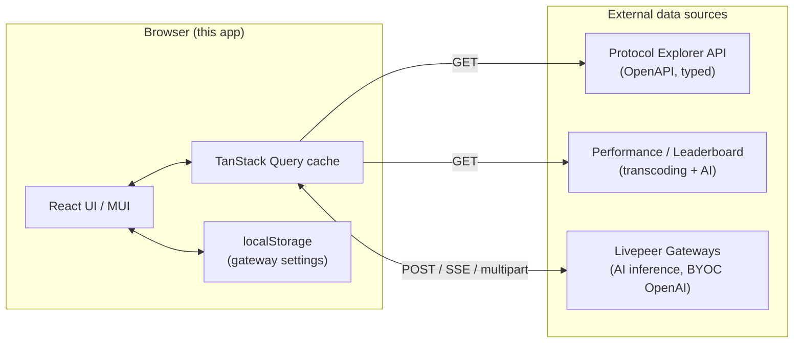
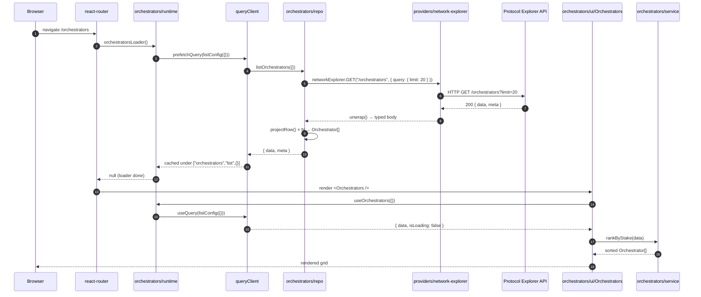
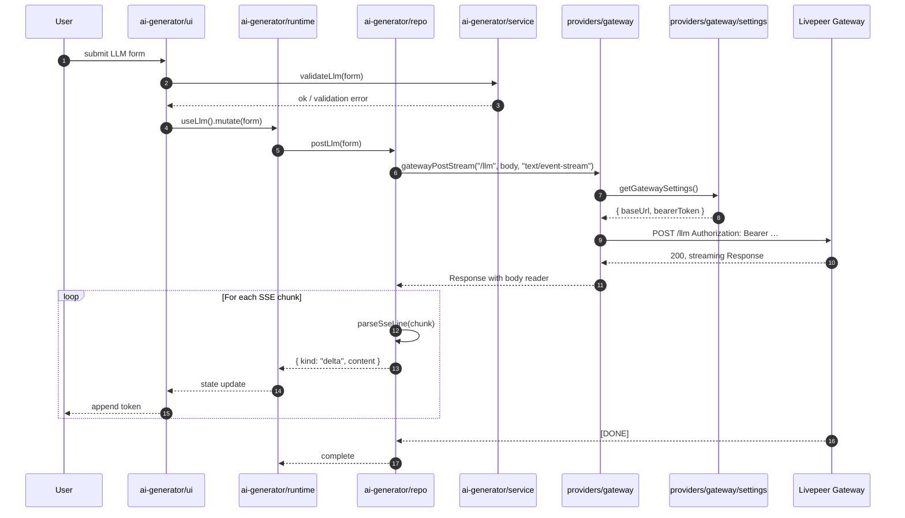
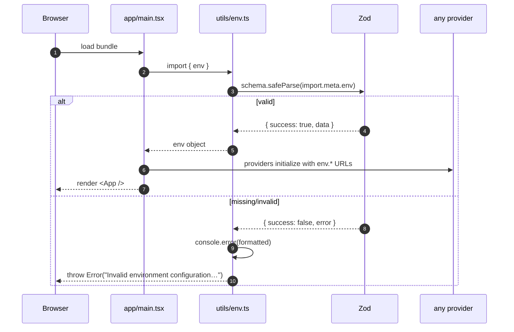

# Architecture

A self-contained tour of how `livepeer-tools-ui` is put together. Start here, then dive into the linked design docs (`docs/DESIGN.md`, `docs/FRONTEND.md`, `docs/design-docs/`) when you need the long form.

This codebase is agent-generated. The architecture exists to make it legible to coding agents and to humans: clear seams, mechanical enforcement, no folklore.

## What it is

A browser-only React/TypeScript SPA that visualizes the Livepeer protocol and ecosystem. It is a thin presentation layer over three independent external data sources — there is no backend of our own.



State that needs to survive a reload uses `localStorage`. No chain RPC, no IndexedDB, no service worker.

## Top-level layout

```
src/
├── app/          Application shell, routing, theme, entry point
├── domains/<n>/  One per business area. Internal layer order enforced.
├── providers/<n>/ Transport layer for the three external systems.
├── generated/    Auto-generated TypeScript from the live OpenAPI spec.
└── utils/        Cross-cutting helpers (env, QueryClient).
docs/             System of record for design + plans.
eslint-rules/     Custom rule that enforces the layering.
tests/            Unit tests + structural tests of the layering.
scripts/          API type regen + drift detection.
```

| Directory                    | Purpose                                                                                                                                                                                                                                            |
| ---------------------------- | -------------------------------------------------------------------------------------------------------------------------------------------------------------------------------------------------------------------------------------------------- |
| `src/app/`                   | Entry point (`main.tsx`), the MUI shell + drawer (`App.tsx`), the route table (`routes.tsx`), the theme (`theme.ts`), the home page (`Home.tsx`). Imports only `runtime` and `ui` from any domain — never `repo`, `service`, `config`, or `types`. |
| `src/domains/*`              | Nine business modules: `ai-generator`, `gateways`, `governance`, `network`, `orchestrators`, `payouts`, `performance`, `rewards`, `tickets`. Each is self-contained with a fixed layer order (see below).                                          |
| `src/providers/*`            | Three transports: `network-explorer`, `performance`, `gateway`. Each speaks one external system. Providers do not import each other and do not import any domain.                                                                                  |
| `src/generated/api-types.ts` | TypeScript types regenerated from the network-explorer OpenAPI spec. Committed to the repo. Imported only by `src/providers/network-explorer/client.ts`. CI fails on drift.                                                                        |
| `src/utils/`                 | `env.ts` (Zod-validated `import.meta.env` at module load) and `queryClient.ts` (singleton TanStack Query client). Nothing here is domain-aware.                                                                                                    |

## The layering rule (the most important constraint)

Within `src/domains/<name>/`, files may only import from same-or-lower layers in the **same** domain:

```
types → config → repo → service → runtime → ui
```

Plus three cross-cutting rules:

1. **No cross-domain imports.** `orchestrators` cannot reach into `governance`. Shared pure logic lives in `src/utils/`. Shared transport lives in a provider.
2. **Only `repo.ts` may import from `src/providers/`.** Services, runtimes, and UIs talk to repos. They do not touch transport directly.
3. **Providers may not import from `src/domains/`.** Transport never depends on business logic. The reverse direction is the only one allowed.
4. **`src/app/` may only import a domain's `runtime` or `ui`.** App composes routes and hooks; it doesn't reach into a domain's internals.

### How the rule is enforced

Three independent checks, all wired into CI:

| Mechanism            | File                                         | Runs on                    |
| -------------------- | -------------------------------------------- | -------------------------- |
| Custom ESLint rule   | `eslint-rules/no-cross-layer-imports.js`     | `npm run lint`, pre-commit |
| Structural unit test | `tests/structural/layer-imports.test.ts`     | `npm run test`             |
| Provider silo test   | `tests/structural/no-cross-provider.test.ts` | `npm run test`             |

The ESLint rule reports specific message IDs (`crossDomain`, `higherLayer`, `providerOutsideRepo`, `providerImportsDomain`, `appImportsInternal`) so violations are self-explanatory in editor output. The structural tests walk `src/` and re-derive the layer of every file from its path, providing a backstop that catches anything the linter misses (e.g., dynamic imports).

If you find yourself wanting to break a rule, the right answer is almost always to introduce a provider, extract a pure helper to `src/utils/`, or split a domain — not to add an exemption.

## Anatomy of a domain

Every domain follows the same skeleton. Using `src/domains/orchestrators/` as the canonical example:

```
orchestrators/
├── types.ts       Pure domain types. No I/O. (Orchestrator, OrchestratorListParams, …)
├── config.ts      Constants. (DEFAULT_PAGE_SIZE, MAX_PAGE_SIZE)
├── repo.ts        Calls one or more providers; projects raw shapes → domain types.
├── service.ts     Pure functions over domain types. (shortAddress, rankByStake, formatLpt)
├── runtime.ts     TanStack Query hooks + react-router loaders. Cache keys live here.
└── ui/
    ├── index.tsx                 Exports `orchestratorRoutes` (<Route> fragment) + components.
    ├── Orchestrators.tsx         List page.
    ├── OrchestratorDetail.tsx    Detail page.
    └── OrchestratorCard.tsx      Reusable card.
```

A few patterns worth noting from `orchestrators/repo.ts`:

- The boundary projection (`projectRow`) is the place where snake-case string-encoded amounts from the API become camelCase typed numbers in the domain. Once data passes that line, downstream code can trust the shape.
- `clampLimit()` sanitizes input that's about to go onto the wire. Validation happens at boundaries — entering and leaving.
- The function signatures expose the domain vocabulary (`Orchestrator`, not `OrchestratorProfileRow`). Provider types do not leak.

`runtime.ts` defines the **cache key convention** that all domains follow:

```ts
const listKey = (params) => ["orchestrators", "list", params] as const;
const detailKey = (address) => ["orchestrators", "detail", address.toLowerCase()] as const;
```

`[domain, action, ...args]`. Same key for the loader prefetch and the hook read, so the page renders instantly with no flash of loading state.

## Providers

| Provider           | External system(s)                                                                              | Types                                                       | Boundary parsing                                               | Auth                                              |
| ------------------ | ----------------------------------------------------------------------------------------------- | ----------------------------------------------------------- | -------------------------------------------------------------- | ------------------------------------------------- |
| `network-explorer` | `livepeer-network-api.cloudspe.com/api/v1`                                                      | Generated from OpenAPI (`src/generated/api-types.ts`)       | Trusted at compile-time; runtime error envelope via `unwrap()` | None                                              |
| `performance`      | `leaderboard-serverless.vercel.app` (transcoding), `lpc-leaderboard-serverless.vercel.app` (AI) | Hand-rolled Zod (`schemas.ts`)                              | Zod `.parse()` on every response                               | None                                              |
| `gateway`          | `dream-gateway.livepeer.cloud` (or user-overridden), `openai-gateway.livepeer.cloud/v1` (BYOC)  | Hand-rolled Zod for known endpoints; raw JSON for inference | Zod where applicable; AI endpoints pass through                | Bearer token (env default, localStorage override) |

Each provider exposes:

- A typed **client** (`openapi-fetch` for network-explorer; thin `fetch` wrappers for the others).
- An **error class** (`NetworkExplorerError`, `PerformanceError`, `GatewayError`) carrying status and a truncated body for diagnostics.
- An `index.ts` that re-exports the public surface. **Domains import from `@/providers/<name>` only — never from internal files.**

The gateway provider has one extra wrinkle: `settings.ts` reads and writes user gateway preferences (URL, bearer token) to `localStorage`, falling back to env defaults. This is the only piece of state in the app that persists across reloads. The AI domain listens for a custom `window` event and re-fetches capabilities when settings change.

## Sequence diagrams

### 1. Page load: `/orchestrators`



The point of this dance: the loader populates the cache during the route transition, and the component reads from the same cache key — so the page paints with data on first render. No spinner flash. No double fetch.

### 2. AI inference (streaming LLM)



Streaming is the reason `gatewayPostStream` returns the raw `Response` instead of parsed JSON: the repo controls the chunk loop and decides how to emit deltas back up the stack.

### 3. Startup: env validation



Validation happens once, at module-load. There is no fallback. If `.env` is missing, the app fails loudly with a list of which variables are wrong — that's the design.

## State and data flow

- **TanStack Query** is the only data-fetching layer. The singleton client lives in `src/utils/queryClient.ts` (staleTime 30 s, retry 1, no refetch on focus). It is provided to the tree in `src/app/main.tsx`.
- **Loaders prefetch; hooks read.** Domain `runtime.ts` files expose both, keyed identically.
- **Local state** uses `useState` / `useReducer`. There is no Redux, no Zustand, no global store.
- **Persistence**: only `localStorage`, only for gateway settings. No IndexedDB.
- **No global context providers** beyond `ThemeProvider`, `QueryClientProvider`, and `RouterProvider`.

## Build, test, and tooling

| Tool               | Where                        | Notes                                                                                   |
| ------------------ | ---------------------------- | --------------------------------------------------------------------------------------- |
| Vite               | `vite.config.ts`             | `@/*` → `src/*` alias. React plugin. Dev port 5173 (non-strict).                        |
| TypeScript         | `tsconfig.json`              | Strict mode + `noUncheckedIndexedAccess`, `noImplicitOverride`, `verbatimModuleSyntax`. |
| ESLint             | `eslint.config.js`           | Flat config. `local/no-cross-layer-imports` is wired here.                              |
| Prettier           | (repo default)               | `npm run fmt` / `fmt:check`. CI enforces.                                               |
| Vitest             | `vitest.config.ts`           | Runs unit tests + structural tests. No DOM (services are pure).                         |
| Lefthook           | `lefthook.yml`               | Parallel pre-commit: typecheck, lint (staged), format check (staged).                   |
| openapi-typescript | `scripts/regen-api-types.sh` | Regenerates `src/generated/api-types.ts` from the live OpenAPI spec.                    |

### `gen:api` and `check:api-drift`

`scripts/regen-api-types.sh` fetches the network-explorer OpenAPI spec, runs `openapi-typescript`, post-processes the `operations` interface (the upstream spec has duplicate operation IDs across path families, which breaks TS), formats the result, and writes it to `src/generated/api-types.ts`. **Commit the diff.**

`scripts/check-api-drift.sh` runs the same generation into a temp file and diffs it against the committed copy. CI fails if they differ. This guarantees the generated types reflect the live spec at every merge.

### CI

`.github/workflows/ci.yml` has two jobs:

- **`validate`** — install, format check, typecheck, lint, test, build. All `VITE_*` env vars are set at job level so every step can load the env module.
- **`api-drift`** — install, run `check:api-drift`. Independent so a spec change doesn't gate the rest of the build.

Concurrency cancels in-progress runs on the same ref.

## Adding new code: where it goes

| You want to…                               | Do this                                                                                                                                                                                                   |
| ------------------------------------------ | --------------------------------------------------------------------------------------------------------------------------------------------------------------------------------------------------------- |
| Add a new page in an existing area         | Add a component under that domain's `ui/`. Register a `<Route>` in its `ui/index.tsx`. If you need data, add a hook in `runtime.ts`.                                                                      |
| Add a new endpoint on an existing provider | Add the function in `providers/<name>/client.ts`. Re-export from `index.ts`. Call it from the relevant domain's `repo.ts`, projecting to domain types.                                                    |
| Add a new business area                    | Create `src/domains/<name>/` with `types.ts`, `config.ts`, `repo.ts`, `service.ts`, `runtime.ts`, `ui/index.tsx`. Compose the routes fragment into `src/app/routes.tsx`. Add tests under `tests/<name>/`. |
| Add a new external data source             | Create `src/providers/<name>/` with `client.ts`, `schemas.ts` (Zod, if no OpenAPI), `index.ts`, and an `<Name>Error` class. Use Zod at the boundary.                                                      |
| Cache state across reloads                 | Use `localStorage`. Read defaults from `env`. Follow the pattern in `src/providers/gateway/settings.ts`.                                                                                                  |
| Share logic between two domains            | Don't import sideways. If it's pure, lift to `src/utils/`. If it's transport, it's a provider.                                                                                                            |

The structural tests will block a PR that takes a shortcut around the rules. Treat them as a hint to redesign, not as something to silence.

## What this codebase deliberately does not do

- **No backend.** Every byte comes from one of the three providers above.
- **No chain RPC.** State is read through the network-explorer API, not via `eth_call`.
- **No global store.** TanStack Query is the cache; component state covers the rest.
- **No CSS framework beyond MUI.** Styling uses MUI's `sx` prop / theme.
- **No SSR.** Browser-only. `typeof window !== "undefined"` guards exist only so localStorage helpers can be safely imported by code that runs before mount.
- **No service worker, IndexedDB, or chain interaction.**

## Further reading

- `docs/DESIGN.md` — the original design that this implementation follows.
- `docs/FRONTEND.md` — frontend conventions (MUI usage, routing, theme).
- `docs/design-docs/core-beliefs.md` — the load-bearing principles.
- `docs/design-docs/providers-and-boundaries.md` — the full provider rationale.
- `docs/PRODUCT_SENSE.md` — product intent and non-goals.
- `docs/PLANS.md` — index of active and completed execution plans.
- `AGENTS.md` — table of contents for the repo as a whole.
